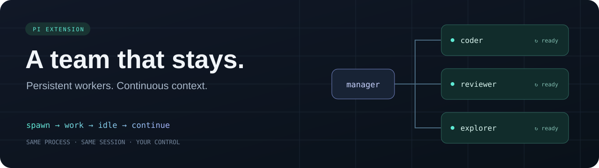

<div align="center">



# Pi Persistent Subagents

**Spawn once. Keep the context. Work together.**

Long-lived worker agents for [Pi](https://github.com/earendil-works/pi).<br>
Delegate a task, let the worker settle, then continue in the **same live process**.

[](https://github.com/RobertKoval/pi-persistent-subagents/actions/workflows/ci.yml)
[](LICENSE)
[](https://github.com/earendil-works/pi)
[](package.json)

[Quick start](#quick-start) · [Tools](#six-tools-one-workflow) · [Configuration](docs/configuration.md) · [How it works](docs/architecture.md)

</div>

## Why persistent workers?

A worker owns an ongoing workstream: a code area, an investigation, or a review. When it finishes a task, it becomes idle and stays available. Follow-up work keeps its PID, conversation, and eligible process-local provider state.

- **Continue without restarting.** Reuse a worker with `send_input`.
- **Steer work in flight.** Redirect, queue a follow-up, or interrupt.
- **See what is happening.** Get compact TOON status; request full results and token/cache diagnostics when needed.
- **Resume deliberately.** Close a worker and reopen its saved conversation later.
- **Keep ownership clear.** Workers exit when the parent shuts down; sessions remain resumable.

Persistent processes preserve cache *eligibility*. They do not guarantee cache hits or quota savings. [Understand the distinction →](docs/architecture.md#cache-and-usage)

## Quick start

Requires **Pi 0.85.x** and **Node.js 22.19+**. Authenticate your provider in Pi first.

```sh
pi install git:https://github.com/RobertKoval/pi-persistent-subagents
```

Start Pi, then ask:

> Create a persistent worker to review this module. When it finishes, ask the same worker to check the tests. Keep it available for follow-up questions.

Use `/pworkers` to see your workers. The model receives the six tools below automatically.

To try a local checkout without installing globally:

```sh
git clone https://github.com/RobertKoval/pi-persistent-subagents.git
cd pi-persistent-subagents
npm ci --ignore-scripts
pi -e .
```

## Six tools, one workflow

| Tool | What it does |
| --- | --- |
| `spawn_agent` | Start a persistent worker with a task and optional role/model. |
| `send_input` | Continue an idle worker, steer a running one, queue work, or interrupt. |
| `wait_agent` | Wait for any/all selected workers. A timeout leaves them alive. |
| `list_agents` | Inspect worker states in a compact list; fetch results and diagnostics when needed. |
| `close_agent` | Stop the process and retain its conversation. |
| `resume_agent` | Start a new process on the saved conversation. |

```text
spawn_agent ── task ──▶ idle ── send_input ──▶ task ──▶ idle
                         ╰──────── same PID + session ─────╯

close_agent ──▶ saved session ── resume_agent ──▶ new PID
```

`send_input` modes: `auto` (default), `steer`, `follow_up`, `interrupt`.<br>
See [the tool reference](docs/tools.md) for parameters and lifecycle details.

## Choose a small team

Save this as `.pi/persistent-subagents.json` in your project. Use model IDs available to your account:

```json
{
  "maxAgents": 3,
  "roles": {
    "coder": { "model": "gpt-5.6-luna", "thinking": "low" },
    "reviewer": { "model": "gpt-5.6-terra", "thinking": "medium" }
  }
}
```

Roles inherit the parent's provider unless overridden. With [pi-accounts](https://github.com/narumiruna/pi-extensions/tree/main/packages/pi-accounts) 0.51, new workers also inherit its session-local named selection without copying credentials. Existing and resumed workers keep their original selection.

[All settings and precedence →](docs/configuration.md)

## Local usage and capacity reports

Run `/pmetrics` for a local dashboard with per-project/day usage, observed stream throughput, task timings, concurrency and immutable API-equivalent cost estimates. Export JSON or CSV. Worker tracking defaults on; main-agent tracking defaults off; both have independent switches.

The shared SQLite database contains metrics only, without prompts, responses or tool arguments. [Measurement methods and limitations →](docs/metrics.md)

## Practical boundaries

Workers have the same OS permissions as Pi and share a working directory unless you override `cwd`. There is no automatic sandbox or Git worktree isolation. Coordinate edits to shared files.

By default, workers do not create another generation of this extension's workers. The depth limit applies to this extension; it does not disable unrelated installed tools. Sessions and results are local data, retained for resume—not automatically deleted on shutdown.

## Development

```sh
npm ci --ignore-scripts
npm test
npm run typecheck
npm run test:e2e
```

Default tests use fake RPC processes and make **no model calls**. The opt-in Pi smoke also makes no model call. Live tests exercise real providers and consume quota; see [testing](docs/testing.md).

Bug reports and focused contributions are welcome. [Contributing](CONTRIBUTING.md) · [Security](SECURITY.md) · [MIT license](LICENSE)
