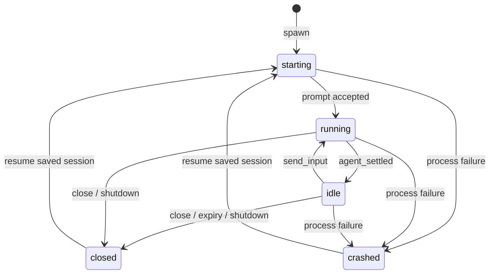

# Architecture

Each worker is a long-lived `pi --mode rpc --session …` process. The parent owns it directly; there is no background daemon.

## Boundaries

- `index.ts` adapts the Pi extension API, tools and notifications.
- `completion-inbox.ts` owns unread result snapshots and notification delivery; it does not orchestrate tasks.
- `pool.ts` owns worker lifecycles and orchestration.
- `rpc-client.ts` owns processes, request IDs, deadlines and shutdown.
- `jsonl.ts` handles strict LF framing; Unicode line separators remain valid string content.
- `registry.ts` persists metadata through atomic replacement.
- `account-selection.ts` handles credential-free pi-accounts selection metadata.
- `config.ts`, `selection.ts` and `pi-invocation.ts` handle configuration and launch selection.

## Persistence and cleanup

Storage lives under `<Pi agent directory>/persistent-subagents/parents/<parent-scope>/`. A parent scope contains a registry and each worker's session JSONL. Registry files use owner-only file permissions; task text and output are local sensitive data even though credentials are not registry fields.

Settling keeps a worker alive. Explicit close, configured idle expiry, or parent shutdown ends its process. Session files remain for resume. On reload, persisted live-looking entries are treated as closed; metadata does not mean an old process has been adopted.

The installed Pi runtime also handles stdin closure and signals. Automated live tests exercise parent termination with idle and active workers and their shell descendants. These tests are platform/runtime-specific evidence, not a guarantee against every external crash scenario.

## Cache and usage

Three distinct properties matter:

1. **Transcript continuity:** a saved session survives process restarts.
2. **Prompt-cache eligibility:** provider-controlled reuse of an input prefix.
3. **Process-local continuation:** transport/session state held in a live process.

Persistent workers preserve the third property while the process lives. Resume restores the first but starts a new process. Pi's Codex implementation may reuse sockets and previous-response state, subject to its own TTLs and reconnection policy.

Usage is accumulated from actual assistant message events: `input`, `output`, `cacheRead`, `cacheWrite`, and `turns` (assistant messages with usage, including intermediate tool-use messages). Cache tokens can be reported after process restarts too. No fixed hit rate, speedup, billing or subscription-quota saving is promised.

## Compatibility

The supported API line is Pi 0.85.x. Offline process tests, declaration checks and an installed-Pi command smoke cover the extension boundary. Live provider tests are opt-in. See [testing](testing.md) for reproducible commands and scope.
